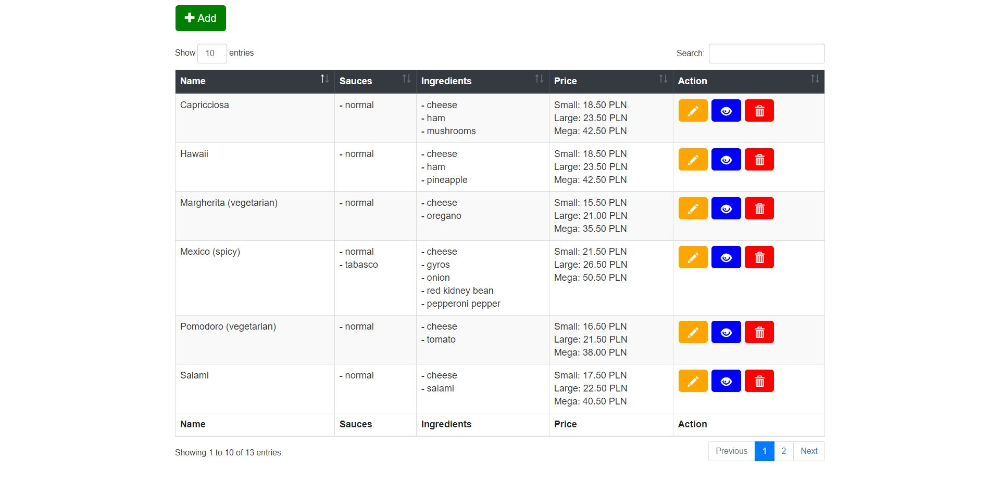

# Pizzeria - CRUD using JavaScript

## Project includes
- simple XML database
- CSS that trasform XML code 
- DTD file that validate XML database
- XSD file that validate XML database
- XSL file that generates HTML code 
- JavaScript CRUD 

## Preview
https://htmlpreview.github.io/?https://github.com/mateuszniewiadomski/Pizzeria/blob/master/database.html
